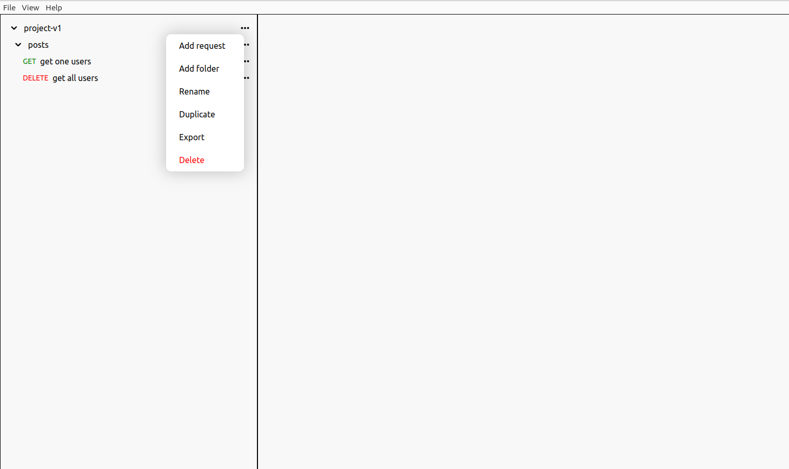

# DevSensei🥷🏻: tool for Testing and Debugging API

 

**DevSensei** testing and debugging app is a versatile tool for developers who want to streamline their workflow and simplify the process of testing and debugging API endpoints. With a user-friendly interface

## Run:

1.  `git clone https://github.com/duckduckcodes/devsensei`

2.  `cd devsensei`

3.  `npm install`

4.  `npm start`

then you can edit `src/renderer`

## Todo:
 -  [ ] **Iterate through folders recursively:** currently, when user wants to add a new request or a folder, i iterate through folder, but i only look for the first children folders, imaging if the folder is nested (folder inside folder inside folder ect...),
 that's why we need to go through the whole folders structure to find that folder with its id, and add sub-folder/request.

 -  [ ] **Link tabs to their content:** When a tab is clicked, its corresponding content should be displayed. Make sure to properly associate each tab with its content.

 -  [ ] **Enable user to delete requests:** Implement a way for the user to delete existing requests from the UI, such as a button or context menu. Make sure to properly update the state to remove the deleted request.

 -  [ ] **Finish response container code:** Complete any remaining implementation for the response container, such as displaying the response data or handling errors.

 -  [ ] **Fix bugs in request container, specifically related to params:** Identify and fix any bugs in the request container, especially those related to handling request parameters. This may require refactoring or updating existing code.
### Example:

## Contributing

We welcome contributions from developers who want to help us improve this app. If you'd like to contribute, please check out our CONTRIBUTING.md file for more information.

| :exclamation: this was tested only on linux |
| ------------------------------------------- |

MIT License
Copyright (c) 2023 duckduckcodes see the LICENSE.md file for details.
